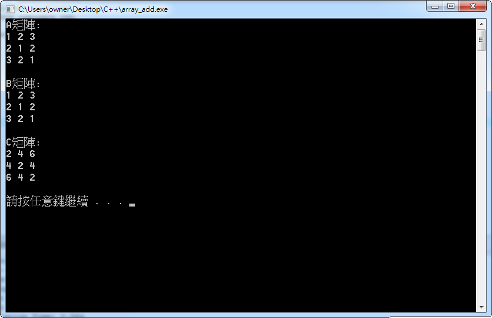
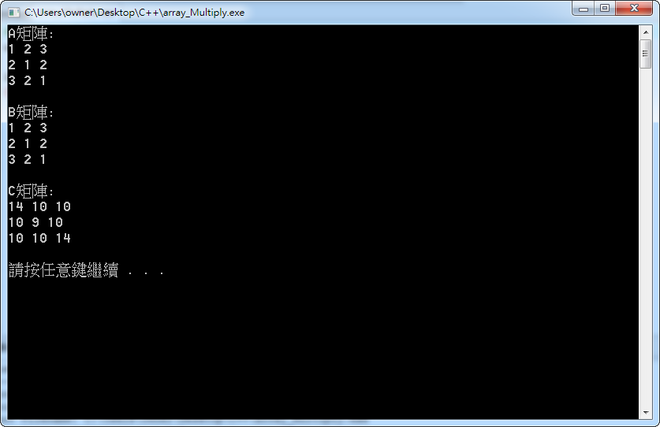

# 矩陣練習 

#### 矩陣加法
```
#include <iostream>
using namespace std;

int main(void)
{
	int a[3][3],b[3][3],c[3][3];

	for(int i=0;i<3;i++){
		for(int j=0;j<3;j++){
			if(i==j){
				a[i][j]=b[i][j]=1;
			}else if((i==(j+1)) || (i==(j-1))){
				a[i][j]=b[i][j]=2;
			}else{
				a[i][j]=b[i][j]=3;
			}
		}
	}

	cout << "A矩陣:" << endl;
	for(int i=0;i<3;i++){
		for(int j=0;j<3;j++){
			cout << a[i][j] << " ";
		}
		cout << endl;
	}
	cout << endl;

	cout << "B矩陣:" << endl;
	for(int i=0;i<3;i++){
		for(int j=0;j<3;j++){
			cout << b[i][j] << " ";
		}
		cout << endl;
	}
	cout << endl;

	for(int i=0;i<3;i++){
		for(int j=0;j<3;j++){
			c[i][j]=a[i][j]+b[i][j];
		}
	}

	cout << "C矩陣:" << endl;
	for(int i=0;i<3;i++){
		for(int j=0;j<3;j++){
			cout << c[i][j] << " ";
		}
		cout << endl;
	}
	cout << endl;

	system("pause");
	return 0;
}
```
##### 相加結果:


#### 矩陣乘法
```c++
#include <iostream>
using namespace std;

int main(void)
{
	int a[3][3],b[3][3],c[3][3];

	for(int i=0;i<3;i++){
		for(int j=0;j<3;j++){
			if(i==j){
				a[i][j]=b[i][j]=1;
			}else if((i==(j+1)) || (i==(j-1))){
				a[i][j]=b[i][j]=2;
			}else{
				a[i][j]=b[i][j]=3;
			}
		}
	}

	cout << "A矩陣:" << endl;
	for(int i=0;i<3;i++){
		for(int j=0;j<3;j++){
			cout << a[i][j] << " ";
		}
		cout << endl;
	}
	cout << endl;

	cout << "B矩陣:" << endl;
	for(int i=0;i<3;i++){
		for(int j=0;j<3;j++){
			cout << b[i][j] << " ";
		}
		cout << endl;
	}
	cout << endl;

	for(int i=0;i<3;i++){
		for(int j=0;j<3;j++){
			int sum=0;
			for(int k=0;k<3;k++){
				sum+=(a[i][k]*b[k][j]);
			}
			c[i][j]=sum;
		}
	}

	cout << "C矩陣:" << endl;
	for(int i=0;i<3;i++){
		for(int j=0;j<3;j++){
			cout << c[i][j] << " ";
		}
		cout << endl;
	}
	cout << endl;

	system("pause");
	return 0;
}
```
##### 相乘結果:

